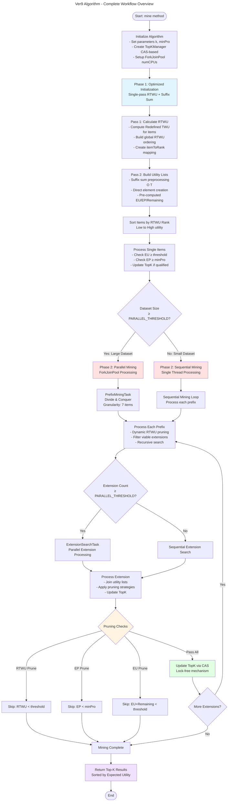

# OOTK-HUIM: Object-Oriented solution for Top-K High-Utility Itemset Mining from Uncertain Databases




1. check maven version:
- Maven installation size:
```bash
du -sh /opt/homebrew/Cellar/maven/*
```

2. Create new version(start from version/ver{i|i=1-9}/ e.g. version/ver1/ replace DartifactId):
```bash
mvn archetype:generate \
    -DgroupId=huim \
    -DartifactId=ver{i}_{1-9} \
    -DarchetypeArtifactId=maven-archetype-quickstart \
    -DinteractiveMode=false
```

4. Object-Oriented-TopK-HUIM-Pos-Neg is the root: go to directory version/ver{i}/ver{i}_{0-9}

- To compile/build:
```bash
mvn clean package
```

- To run main to check if Maven setup is fine (replace mainClass with directory to main in target)
```bash
mvn exec:java -Dexec.mainClass="ver{i}_{1-9}"
```

- Run with data (replace mainClass with directory to main in target)
```bash
mvn exec:java -Dexec.mainClass="ver{i}_{1-9}" \
    -Dexec.args="../../../data/test_database.txt ../../../data/test_profits.txt 100 0.2"
```
